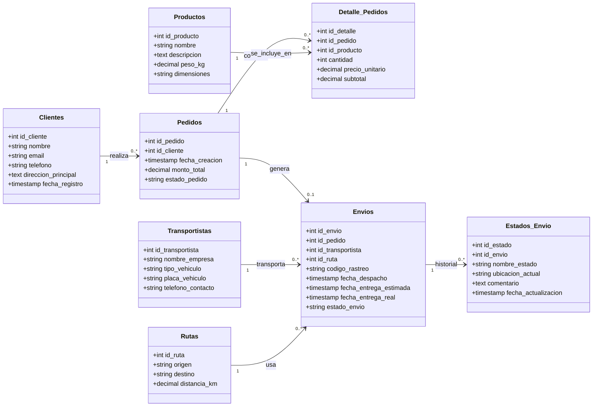

# Diagrama de clases - Logística Mercancías

```mermaid
classDiagram
direction LR

class Clientes {
  +int id_cliente
  +string nombre
  +string email
  +string telefono
  +text direccion_principal
  +timestamp fecha_registro
}

class Productos {
  +int id_producto
  +string nombre
  +text descripcion
  +decimal peso_kg
  +string dimensiones
}

class Transportistas {
  +int id_transportista
  +string nombre_empresa
  +string tipo_vehiculo
  +string placa_vehiculo
  +string telefono_contacto
}

class Rutas {
  +int id_ruta
  +string origen
  +string destino
  +decimal distancia_km
}

class Pedidos {
  +int id_pedido
  +int id_cliente
  +timestamp fecha_creacion
  +decimal monto_total
  +string estado_pedido
}

class Detalle_Pedidos {
  +int id_detalle
  +int id_pedido
  +int id_producto
  +int cantidad
  +decimal precio_unitario
  +decimal subtotal
}

class Envios {
  +int id_envio
  +int id_pedido
  +int id_transportista
  +int id_ruta
  +string codigo_rastreo
  +timestamp fecha_despacho
  +timestamp fecha_entrega_estimada
  +timestamp fecha_entrega_real
  +string estado_envio
}

class Estados_Envio {
  +int id_estado
  +int id_envio
  +string nombre_estado
  +string ubicacion_actual
  +text comentario
  +timestamp fecha_actualizacion
}

Clientes "1" --> "0..*" Pedidos : realiza
Pedidos "1" --> "0..*" Detalle_Pedidos : contiene
Productos "1" --> "0..*" Detalle_Pedidos : se_incluye_en
Pedidos "1" --> "0..1" Envios : genera
Transportistas "1" --> "0..*" Envios : transporta
Rutas "1" --> "0..*" Envios : usa
Envios "1" --> "0..*" Estados_Envio : historial
```